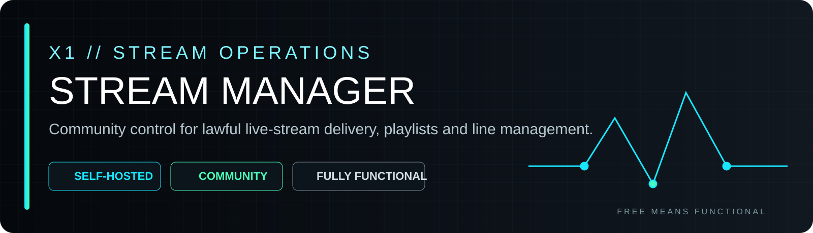
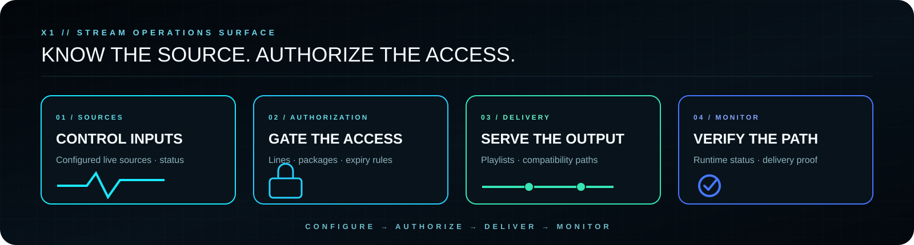
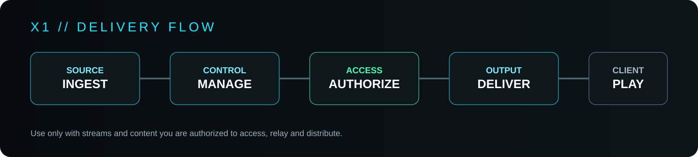
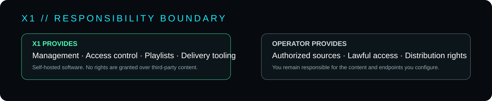

<p align="center">
  
</p>

<p align="center">
  <strong>PUBLIC · COMMUNITY · SELF-HOSTED</strong><br>
  Stream control for authorized live sources, managed access and operational delivery.
</p>

<p align="center">
  <a href="https://x1panel.space"><strong>WEBSITE</strong></a>
  &nbsp;·&nbsp;
  <a href="https://forum.x1panel.space"><strong>FORUM</strong></a>
  &nbsp;·&nbsp;
  <a href="https://discord.gg/vSSw6jHmw"><strong>DISCORD</strong></a>
  &nbsp;·&nbsp;
  <a href="https://t.me/+XkuQS_QuD6g4Nzc0"><strong>TELEGRAM</strong></a>
</p>

---

## X1 Stream Manager Community

**X1 Stream Manager Community is a public, self-hosted stream-management project from X1.**

> **Free means functional.**
> This public release is intended to be useful as released and is not a deliberately crippled demo built around paid unlocks.

It is designed for operators who need a practical control layer for **authorized live-stream sources**, playlist delivery, customer/line access and compatible playback workflows.

<p align="center">
  
</p>

---

<p align="center">
  
</p>

## What it controls

- Configured live-stream sources from one self-hosted interface
- Managed playlist outputs
- Customer/line access management
- Expiring access credentials and channel/package assignment
- Compatibility endpoints for supported IPTV-client workflows
- Browser-facing playback and operational status tooling
- Standard PHP-hosting deployment without requiring a large external platform

---

## Operating model

`CONFIGURE` → `AUTHORIZE` → `DELIVER` → `MONITOR`

X1 Stream Manager separates the operator-facing control layer from client-facing delivery. The operator controls configured sources, access rules, lines and playlist outputs. Clients consume only what the operator has explicitly made available to them.

---

<p align="center">
  
</p>

## Security / responsibility boundary

This software does **not** grant rights to third-party streams, channels or media.

Use it only with content, endpoints and services that you are legally authorized to access, manage, relay and distribute. X1 provides the management software; the operator remains responsible for configured sources and applicable rights, laws and service terms.

For any Internet-facing deployment:

- run behind TLS;
- restrict administrative access;
- use strong unique credentials;
- keep PHP and the host OS patched;
- isolate writable application data appropriately;
- monitor access logs and abnormal traffic;
- back up configuration before upgrades.

---

## Requirements

A typical deployment requires:

- PHP 8.x
- Nginx, Apache or Caddy
- PHP cURL / JSON / mbstring / zlib / OpenSSL support
- Write access for the application's local data directory

Exact compatibility can vary by environment. Validate the project in your own server stack before production use.

---

## Installation / Quick Start

1. Download or clone the repository.
2. Place the application in the intended web root.
3. Make the required writable data path available to the web-server user.
4. Open the application and complete the first-run setup.
5. Configure only sources and endpoints you are authorized to use.

Example permission command on a conventional Linux deployment:

```bash
chmod -R 775 data/
```

Do not apply broad permissions blindly on shared or hardened servers; use the minimum permissions required by your deployment model.

---

## Runtime truth

A source configured in the panel, a playlist generated by the server and successful client playback are different evidence states. Validate the complete delivery path in the deployment environment before treating it as production-proven.

---

## X1 Community position

This repository is part of the **public X1 software family**. It is separate from the private X1 IPTV Platform, X1 SaaS and other commercial X1 systems. Public X1 projects are not presented as incomplete modules that require a commercial platform to become usable.

**This project can stand on its own.**

---

## Related X1 systems

- [X1 GitHub](https://github.com/x1-dotcom)
- [X1 EPG](https://github.com/x1-dotcom/x1epg)
- [X1 Picons](https://github.com/x1-dotcom/picons)

---

## Community

- Website — https://x1panel.space
- Forum — https://forum.x1panel.space
- Discord — https://discord.gg/vSSw6jHmw
- Telegram — https://t.me/+XkuQS_QuD6g4Nzc0

---

<p align="center">
  <strong>CONTROL THE SOFTWARE. KNOW THE SOURCE. AUTHORIZE THE ACCESS.</strong><br><br>
  <strong>X1 // SOFTWARE · SYSTEMS · OPERATIONS</strong><br><br>
  PUBLIC SOFTWARE. PRIVATE ENGINEERING. ONE X1 IDENTITY.<br><br>
  <strong>© X1Tech Solutions SA · All Rights Reserved</strong>
</p>
